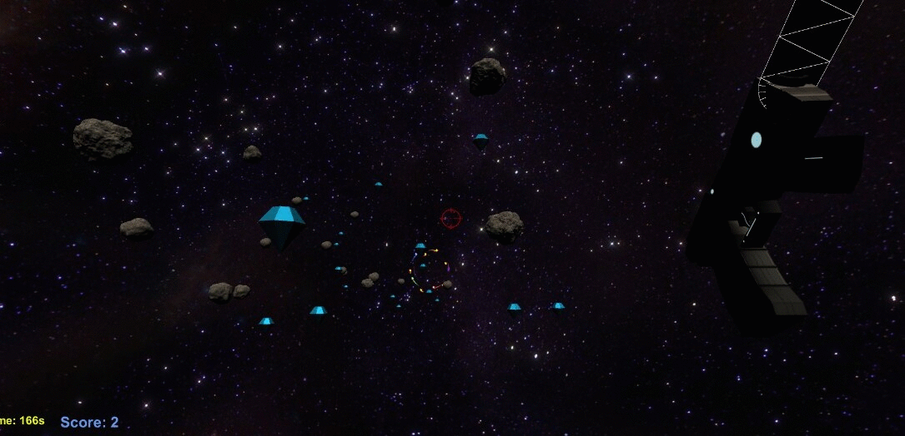

 
  

<h1 align="center"> Grapplingnaut  </h1>
<h3 align="center"> Senior Design: Game Development </h3>
<h5 align="center"> Project 1 - Spring 2021 </h5>

 
  

# Overview

Grapplingnaut is an Endless Runner game where the player traverses through different worlds attempting to escape imminent danger. The story follows an Astronaut who is lost in space after a critical ship failure. The astronaut makes it out alive and notices a Portal in the distance. Equipped with an advanced grappling gun, the Astronaut must grapple onto asteroids in hopes to survive and return back to civilization. 

The game features 7 different worlds with varying difficulties. Each world slighly differs in gameplay but focuses on core grappling mehcanics. 

# How to Play
The game can be found on OneDrive [Download the Game here!](https://ccnymailcuny-my.sharepoint.com/:f:/g/personal/ssadman000_citymail_cuny_edu/EoYj4Wu5sR1BsuQU8Rq9gYkBmS6YfRNgTPkSjCgUF6pkjw?e=F3HA3y)

- Download the project from the link above
- Extract Grapplingnaut_Version_2.0.zip 
- Click Grapplingnaut.exe to Play!

(Note: The Game is approximately 800mb)

## Quick Gameplay

<iframe width="560" height="315" src="https://www.youtube.com/embed/bLS_b4ALFPA" title="YouTube video player" frameborder="0" allow="accelerometer; autoplay; clipboard-write; encrypted-media; gyroscope; picture-in-picture" allowfullscreen></iframe>

## Contributors
- Syed Sadman https://github.com/syedsadman16
- Quoc Do https://github.com/QuocHHDo
- Ahsan Fayyaz https://github.com/ahsan-fayyaz
- Akbar Haider https://www.linkedin.com/in/akbar-haider-539905158/

## Assets
- https://assetstore.unity.com/packages/3d/characters/creatures/dragon-bot-181926
- https://assetstore.unity.com/packages/3d/props/simple-gems-ultimate-animated-customizable-pack-73764
- https://assetstore.unity.com/packages/3d/vehicles/space/low-poly-starship-ss01-29459
- https://assetstore.unity.com/packages/3d/vegetation/trees/dream-forest-tree-105297
- https://assetstore.unity.com/packages/3d/environments/asteroids-pack-84988
- https://assetstore.unity.com/packages/3d/vehicles/space/shoot-em-up-enemy-spikeball-116938
- https://assetstore.unity.com/packages/3d/props/industrial/photoreal-debris-pack-demo-70000
- https://assetstore.unity.com/packages/vfx/particles/fire-explosions/procedural-fire-141496
- https://assetstore.unity.com/packages/3d/environments/sci-fi/destroyed-city-free-6459
- https://assetstore.unity.com/packages/3d/props/exterior/rock-and-boulders-2-6947
- https://assetstore.unity.com/packages/3d/environments/landscapes/autumn-mountain-52251
- https://www.youtube.com/watch?v=Xgh4v1w5DxU&ab_channel=DanisTutorials
- https://www.youtube.com/watch?v=XAC8U9-dTZU&t=197s&ab_channel=DanisTutorials
- https://www.youtube.com/watch?v=chuJ_XIxbhk&t=827s&ab_channel=JimmyVegasJimmyVegas

## License

    Copyright 2021 Syed Sadman

    Licensed under the Apache License, Version 2.0 (the "License");
    you may not use this file except in compliance with the License.
    You may obtain a copy of the License at

        http://www.apache.org/licenses/LICENSE-2.0

    Unless required by applicable law or agreed to in writing, software
    distributed under the License is distributed on an "AS IS" BASIS,
    WITHOUT WARRANTIES OR CONDITIONS OF ANY KIND, either express or implied.
    See the License for the specific language governing permissions and
    limitations under the License.

